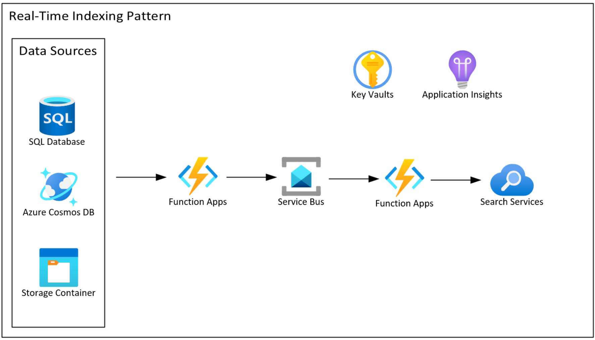
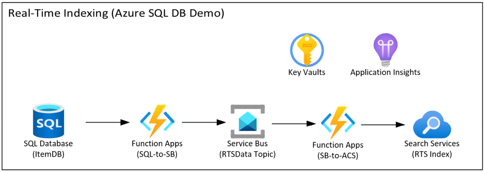
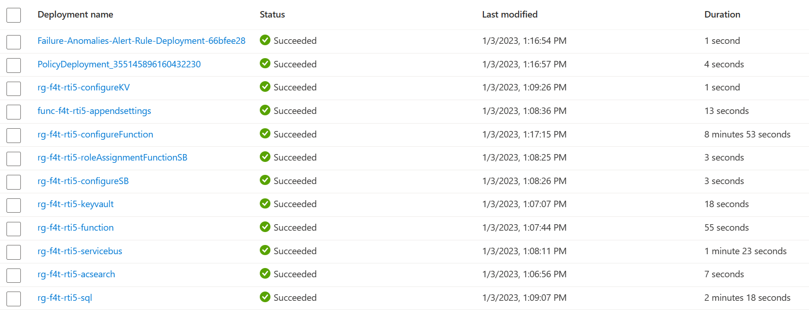

# Azure Cognitive Search - Near Real-time Indexing Pattern

For most scenarios the [Indexers in Azure Cognitive Search](https://learn.microsoft.com/en-us/azure/search/search-indexer-overview) are suitable for indexing data in Cognitive Search. The indexers run on a schedule and the index is at best updated every 5 minutes. However, there are times where real-time indexing is necessary. This article will document the architecture pattern for near real-time indexing in Azure Cognitive Search.

Additionally, there is a demo of using this pattern to index data in Azure SQL Database in near real-time and make it available for searching in Cognitive Search.



The pattern leverages the built-in Triggers and Bindings to capture data changes and queue those changes that are then processed to index using Cognitive Search SDK. Azure Key Vault is used to store secrets such as SQL connection strings and Cognitive Search API key.

The data flow is as follows:
1. Data changes are made to data source (e.g. Azure SQL DB) by applications. Data is added, updated etc.
1. A function is triggered when changes occur, and it queues these changes in Service Bus.
1. A function is triggered when items are queues into the Service Bus topic, and it uses the Cognitive Search SDK to push the changes to the search index.
1. Applications can search for the most updated data.

## Using this patter with Azure SQL Database

The demo is using the Azure SQL Trigger and Bindings for Function app to capture data changes and queue them for indexing in Cognitive Search.



Components:
1. Azure SQL Database, ItemDB which simulates customer data that needs real-time indexing.
1. Azure Function App, contains two functions:
    1. SQL-to-SB function that tracks changes in SQL DB (ItemDB) and queues them to the RTSData topic in Service Bus.
    1. SB-to-ACS function that takes the queued data changes and pushes them to Cognitive Search RTS index.
1. Azure Service Bus, is used for queuing changes to decouple the processing of changes from the source system.
1. Azure Cognitive Search provides the search capability for the SQL DB (ItemDB) data.
1. Azure Key Vault stores the ItemDB connection string and the Cognitive Search Admin API Key.

### Demo Setup

Login to your Azure in your terminal.

```bash
az login
```

To check your subscription.

```bash
az account show
```

Run the deployment. The deployment will create the resource group "rg-\<Name suffix for resources\>". Make sure you are in the 'acs-realtime-indexing' directory.

```bash
git clone https://github.com/fsaleemm/acs-realtime-indexing.git

cd acs-realtime-indexing

az deployment sub create --name "<unique deployment name>" --location "<Your Chosen Location>" --template-file infra/main.bicep --parameters name="<Name suffix for resources>"
```

When promptd, enter SQL Admin account name and the SQL admin password to setup SQL authentication.

The following deployments will run:



#### Create "rts" Search Index

Create an index named "rts" with the following fields in the index schema.

1. id
1. title
1. summary
1. IsDeleted

In the search service Overview page, Add index, an embedded editor for specifying an index schema wll open.

Set Index name: "rts"


#### Create Item table in ItemDB


### Demo Capability
TBD

